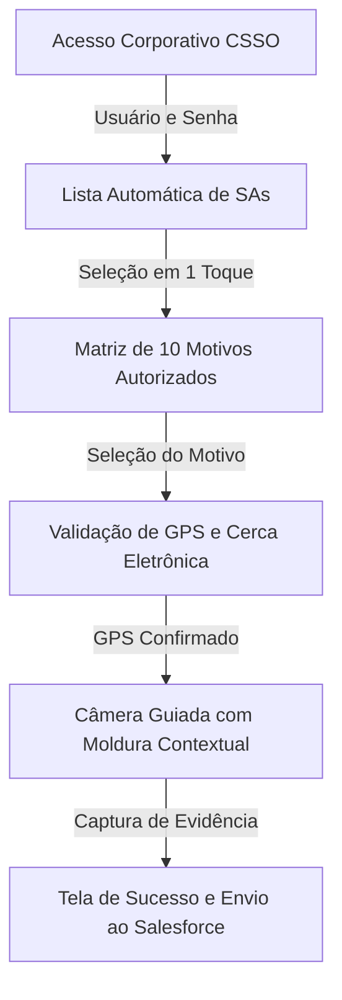

# DESKTOP Quebras • Solução de Mobilidade e Governança em Campo

**Autor**: DESKTOP Telecom / Equipe de Operações & Tecnologia  
**Versão**: 1.0.0 (Pronto para Operação)  
**Stack Tecnológica**: React Native, Expo SDK 54, NativeWind (Tailwind CSS), React Native Reanimated, Expo Location, Expo Camera.

---

## Visão Geral do Projeto

O **DESKTOP Quebras** é um aplicativo móvel corporativo desenvolvido para otimizar e governar o processo de "quebra de atendimento" (suspensão de ordens de serviço) realizado por técnicos de campo da DESKTOP. 

A solução substitui a comunicação informal via WhatsApp e o suporte manual centralizado no COP (Centro de Operações) por um fluxo guiado, automatizado e totalmente auditável, integrado diretamente com o ecossistema Salesforce.

---

## Identidade Visual e Padrão Corporativo

O design do aplicativo e da apresentação executiva segue rigorosamente a identidade visual oficial da **DESKTOP**:
*   **Vinho Corporativo**: `#531110` (Cor primária e elementos de destaque estrutural).
*   **Vermelho Operacional**: `#ae2e2a` (Botões de ação e alertas críticos).
*   **Amarelo Destaque**: `#f4ba44` (Detalhes, molduras de enquadramento e indicadores).

---

## Arquitetura de Telas e Fluxo do Usuário

O fluxo operacional foi desenhado para garantir que o técnico execute suas tarefas com agilidade e precisão, exigindo zero digitação manual de ordens de serviço e garantindo a verificação de presença por geolocalização.



### Detalhamento das Etapas Operacionais

1. **Acesso Corporativo (CSSO)**: Autenticação segura utilizando o padrão CSSO da companhia (Usuário e Senha), garantindo que apenas colaboradores autorizados operem o sistema.
2. **Gestão de SAs**: O aplicativo consome a agenda diária do técnico, exibindo as ordens de serviço pendentes. A busca instantânea por número ou tipo de serviço elimina a necessidade de digitação manual de códigos complexos.
3. **Matriz de Motivos de Quebra**: Exibição dos 10 motivos autorizados pela diretoria operacional, organizados por prioridade (com destaque para *Cliente Ausente*, *Endereço não localizado*, *Sem estrutura*, etc.).
4. **Validação de GPS (Cerca Eletrônica)**: O sistema verifica automaticamente as coordenadas geográficas do dispositivo no momento da solicitação, garantindo que o técnico esteja no local da SA.
5. **Câmera Guiada por Contexto**: Em vez de orientações genéricas, a câmera exibe molduras e instruções específicas baseadas no motivo escolhido (ex.: enquadrar a fachada ou a placa do logradouro para endereço não localizado).
6. **Integração Salesforce**: O registro consolidado (motivo, foto, metadados GPS e timestamp) é transmitido via API para atualizar instantaneamente o status da SA no Salesforce.

---

## Estrutura do Repositório

```text
/home/ubuntu/quebras-mobile/
├── app/
│   ├── (tabs)/
│   │   ├── _layout.tsx      # Configuração de navegação por abas
│   │   └── index.tsx        # Tela principal e máquina de estados do fluxo
│   ├── _layout.tsx          # Provedores globais e tema
│   └── oauth/               # Rotas de callback de autenticação
├── components/              # Componentes reutilizáveis (ScreenContainer, etc.)
├── constants/               # Paleta de cores e configurações de tema
├── presentation_final/      # Apresentação executiva em HTML/CSS para a diretoria
├── assets/images/           # Ícones, splash screens e logotipos corporativos
├── app.config.ts            # Configurações do Expo (permissões de câmera e GPS)
├── tailwind.config.js       # Configuração do NativeWind / Tailwind CSS
└── todo.md                  # Acompanhamento de entregas e tarefas do projeto
```

---

## Guia de Instalação e Execução

### Pré-requisitos
* Node.js (versão 22+)
* Gerenciador de pacotes `pnpm`
* Expo CLI / Expo Go instalado no dispositivo móvel

### Passos para Execução Local

1. **Instalar dependências**:
   ```bash
   pnpm install
   ```

2. **Iniciar o servidor de desenvolvimento e o Metro Bundler**:
   ```bash
   pnpm dev
   ```

3. **Visualizar no dispositivo**:
   * Escaneie o QR Code exibido no terminal utilizando o aplicativo **Expo Go** (Android / iOS) ou acesse o preview web integrado no ambiente de gerenciamento.

---

## Relatório de Conclusão e Entrega

A solução encontra-se **100% pronta para operação**, tendo sido validada nos testes de compilação TypeScript, lint e estabilidade de pacotes. A apresentação executiva destinada à diretoria encontra-se estruturada e disponível no projeto, acompanhada da capa institucional e dos slides de validação operacional.
